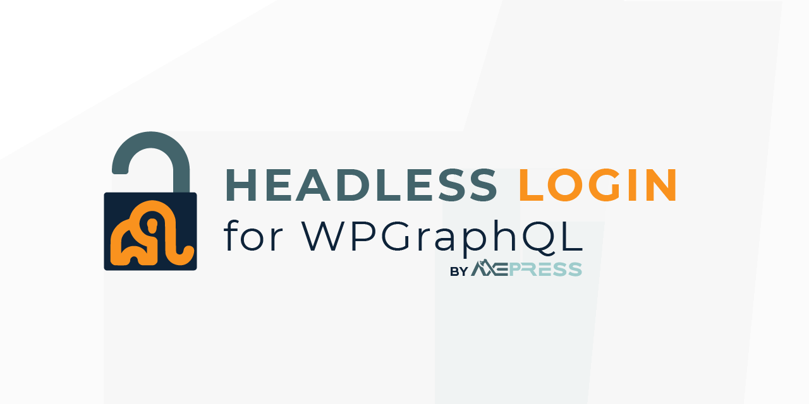

# Headless Login for WPGraphQL

A WordPress plugin that provides headless login and authentication for <a href="https://wpgraphql.com" target="_blank">WPGraphQL</a>, supporting traditional passwords, OAuth2/OpenID Connect, JWT, and more.

* [Join the WPGraphQL community on Slack.](https://join.slack.com/t/wp-graphql/shared_invite/zt-3vloo60z-PpJV2PFIwEathWDOxCTTLA)
* [Documentation](#usage)

-----

    <br />


[](https://coveralls.io/github/AxeWP/wp-graphql-headless-login?branch=develop)
-----

## Description

Headless Login for WPGraphQL is a flexible and extensible plugin that allows headless WordPress sites to login and authenticate users via <a href="https://wpgraphql.com" target="_blank">WPGraphQL</a> using a variety of authentication methods, including traditional WordPress credentials (username/password), <a href="https://oauth.net/2/" target="_blank">OAuth 2.0</a> / <a href="https://openid.net/connect/" target="_blank">OpenID Connect</a>, <a href="https://jwt.io/" target="_blank">JSON Web Tokens (JWT)</a>, and more.

This plugin is inspired by and aims to replace <a href="https://github.com/wp-graphql/wp-graphql-jwt-authentication" target="_blank">WPGraphQL JWT Authentication</a> as more powerful, comprehensive, and flexible authentication solution for Headless WP.

## System Requirements

* PHP 7.4-8.2+
* WordPress 6.0+
* WPGraphQL 1.14.0+

## Quick Install

1. Install & activate [WPGraphQL](https://www.wpgraphql.com/).
2. Download the [latest release](https://github.com/AxeWP/wp-graphql-headless-login/releases) `.zip` file, upload it to your WordPress install, and activate the plugin.
3. Enable and configure the authentication providers you want to use in GraphQL > Settings > Headless Login.

### With Composer

```console
composer require axepress/wp-graphql-headless-login
```

## Updating and Versioning

Until we hit v1.0, we're using a _modified_ version of [SemVer](https://semver.org/), where:

* v0.**x**: "Major" releases. These releases introduce new features, and _may_ contain breaking changes to either the PHP API or the GraphQL schema
* v0.x.**y**: "Minor" releases. These releases introduce new features and enhancements and address bugs. They _do not_ contain breaking changes.
* v0.x.y.**z**: "Patch" releases. These releases are reserved for addressing issue with the previous release only.

## Development and Support

Development of Headless Login for WPGraphQL is provided by [AxePress Development](https://axepress.dev). Community contributions are _welcome_ and **encouraged**.

Basic support is provided for free, both in [this repo](https://github.com/axewp/wp-graphql-headnessl-login/issues) and in [WPGraphQL Slack](https://join.slack.com/t/wp-graphql/shared_invite/zt-3vloo60z-PpJV2PFIwEathWDOxCTTLA).

Priority support and custom development are available to [our Sponsors](https://github.com/sponsors/AxeWP).

<a href="https://github.com/sponsors/AxeWP" alt="GitHub Sponsors"></a>

## Supported Features

The following functionality is currently supported:

- Authenticate with a [WordPress username and password](./docs/reference/mutations.md#login-with-a-traditional-username-password).
- Pass and validate [OAuth 2.0 / OpenID Connect provider response](./docs/reference/mutations.md#login-with-an-oauth2openid-authorization-response) from the frontend. <br />
Supported providers (out of the box):
  * Facebook
  * GitHub
  * Google
  * Instagram
  * LinkedIn
  * OAuth2 - Generic: Any other OAuth 2.0 provider.
  * SAML authentication and more coming soon!
- Use a [special Site Token](./docs/reference/mutations.md#login-with-a-site-token-and-user-identity
) to support WordPress authentication with any  externalaly authenticated user identity (e.g. [Auth.js](https://authjs.dev/)).
- Add your own Authentication Provider by [extending the `ProviderConfig` class](./docs/recipes/provider-config.md).
- Authenticate with JWT tokens using a [HTTP Authorization header]().
- [Set CORS headers](./docs/reference/settings.md) to allow or restrict access to the GraphQL endpoint.
- Generate short-term `authToken`s and long term `refreshToken`s for seamless reauthentication in your headless app.
- [Link a user account](./docs/reference/mutations.md#manually-link-the-wordpress-user-to-a-providers-resource-owner) to an authentication provider's resource owner, to allow users to authenticate with multiple providers.
- Query the [enabled `loginClient` authorization urls](./docs/reference/queries.md#querying-login-clients), to use in your frontend's login buttons.
- Extensive WordPress [actions](./docs/actions.md) and [filters](./docs/reference/filters.md) for customization of the plugin's behavior.
- Log out all sessions for a user by [revoking](./docs/reference/mutations.md#revoke-the-user-secret) or [refreshing](./docs/reference/mutations.md#refresh-the-user-secret) their tokens, in GraphQL or the WordPress backend Profile Page.
- Manage WooCommerce Sessions with [WPGraphQL for WooCommerce](https://github.com/wp-graphql/wp-graphql-woocommerce).
- and more!

## Usage

### Getting Started ( 🎯 You are here! )

- [System Requirements](#system-requirements)
- [Installation](#quick-install)

### Core Concepts

- [Terminology](./docs/core-concepts/terminology.md)
- [How it works](./docs/core-concepts/how-it-works.md)

### Reference

- [Admin Settings](./docs/reference/settings.md)
- [GraphQL Queries](./docs/reference/queries.md)
- [GraphQL Mutations](./docs/reference/mutations.md)
- [Javascript API](./docs/reference/javascript-api.md)
- [WordPress Actions](./docs/reference/actions.md)
- [WordPress Filters](./docs/reference/filters.md)

### Recipes:
- [Server-side Authentication flow with Next.js](./docs/recipes/server-side-auth-next-api-routes.md) ( [demo](https://github.com/AxeWP/axepress-playground/blob/demo/server-side-auth/HowTo.md) ).
- [Client-side Authentication flow with NextAuth.js](./docs/recipes/client-side-auth-nextauth.md)
- [Adding custom `ProviderConfig`s](./docs/recipes/provider-config.md)

## Testing

1. Update your `.env` file to your testing environment specifications.
2. Run `composer install` to get the dev-dependencies.
3. Run `composer install-test-env` to create the test environment.
4. Run your test suite with [Codeception](https://codeception.com/docs/02-GettingStarted#Running-Tests).
E.g. `vendor/bin/codecept run wpunit` will run all WPUnit tests.
