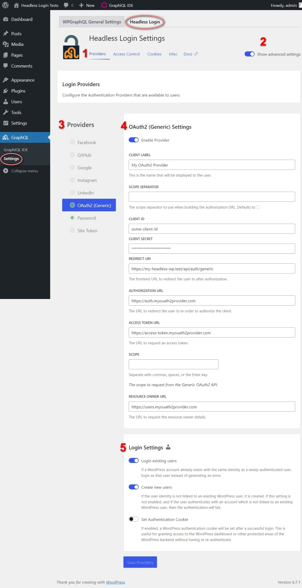
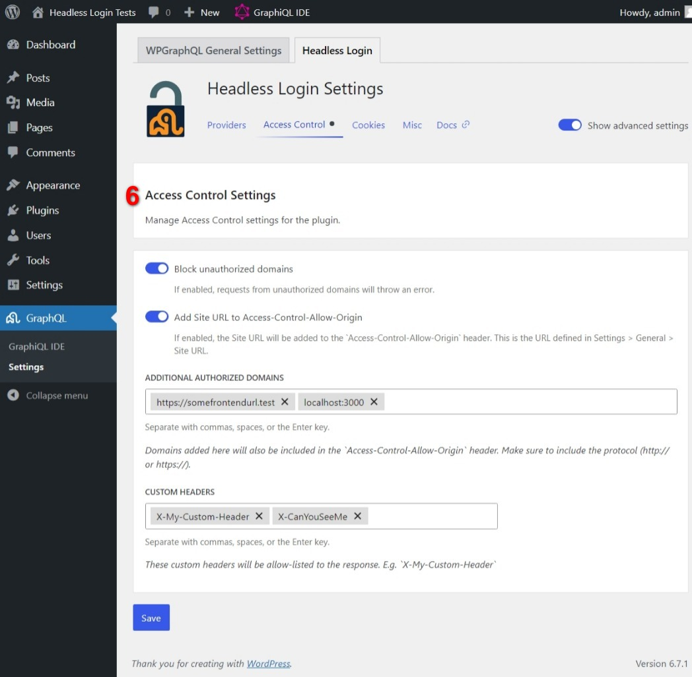
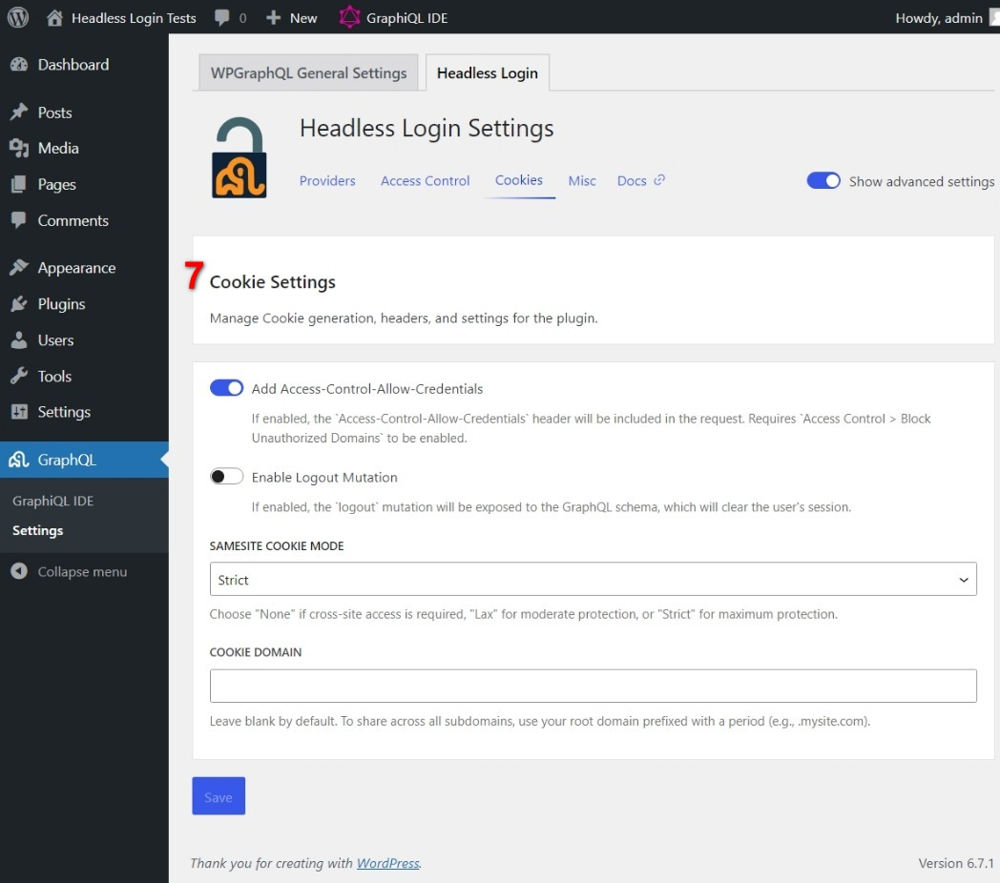
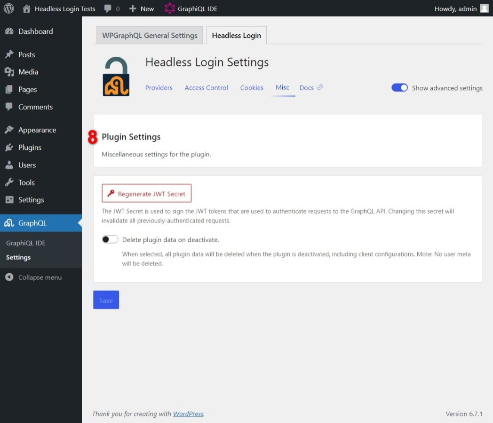

# Settings Guide

You can access the plugin settings by navigating to `GraphQL > Settings > Headless Login` in the WordPress admin.

## Provider Settings

These settings let you configure the authentication providers that you want to use with WPGraphQL.

<a href="./../../assets/screenshot-1.jpg" target="_blank"> 
Full-size screenshot</a>
</a>

1. **Setting Tabs**: These let you switch between the various plugin settings:
   1. **Providers** (Current Screen): The list of registered authentication providers.
   2. **Access Control**: Settings for configuring CORS headers and tightening the security of GraphQL requests.
   3. **Cookies**: Settings for configuring the cookie usage.
	 4. **Misc**: Miscellaneous plugin settings.
2. **Show advanced settings**: This will show the plugin's and provider-specific advanced settings.
3. **Providers**: The list of registered authentication providers. Providers with a green dot are enabled. Click the provider name to edit its settings.
4. **Provider Settings**: The settings for the selected provider. The settings will vary depending on the provider, but usually include the following:
   1. **Client label**: The name of the Client that will be displayed to users.
   2. **Client ID**: The Client ID created by the provider.
   3. **Client secret**: The Client secret created by the provider.
   4. **Redirect URI**: The Redirect URI that the provider will send the authentication response to. This should be the URL of the Callback API route in your headless app.
5. **Login Settings**: The provider-specific settings for provisioning a user. The settings will vary depending on the provider but usually include the following:
   * **Login existing users**: If enabled, the plugin will attempt to login an existing WordPress user with the same email address as the Resource Owner sent from the provider.
   * **Create new users**: If enabled, the plugin will create a new WordPress user if the Resource Owner does not have an existing linked account (or one with the same email address if `Login existing users` is enabled).
   * **Set authentication cookie**: If enabled, the plugin will set a WordPress authentication cookie on successful login. This is useful if you want to use your headless app and WP Admin with the same user session.

## 6. Access Control Settings

These settings let you configure CORS headers, and tighten the security of GraphQl requests.

<a href="./../../assets/screenshot-2.jpg" target="_blank"> 
Full-size screenshot</a>
</a>

   * **Block Unauthorized Domains**: If enabled, the plugin will block all requests from unauthorized domains. This is useful if you want to prevent unauthorized requests from making GraphQL requests.
   * **Add Site URL to Access-Control-Allow-Origin**: If enabled, the plugin will add the WordPress site URL to the `Access-Control-Allow-Origin` header.
   * **Additional Authorized Domains**: A list of additional domains that will be allowed to make GraphQL requests. This is useful if you want to allow requests from a different domain than the WordPress site URL.
   * **Custom Headers**: A list of custom headers that will be added to Access-Control-Allow-Headers. This is useful if your custom implementation requires additional headers.

## 7. Cookies Settings

These settings let you configure the cookie usage.

<a href="./../../assets/screenshot-3.jpg" target="_blank"> 
Full-size screenshot
</a>

   * **Add Access-Control-Allow-Credentials**: If enabled, the plugin will add the `Access-Control-Allow-Credentials` header to GraphQL requests. This is useful if you want to allow authenticated requests from a different domain than the WordPress site URL. Requires `Block Unauthorized Domains` to be enabled.
   * **Enable Logout Mutation**: If enabled, the plugin will add a `logout` mutation to the GraphQL schema. This can be used to delete the authentication cookie and log the user out.
   * **SameSite Cookie Mode**: The `SameSite` attribute of the authentication cookie. This can be set to `None`, `Lax`, or `Strict`. This is useful if you want to allow authenticated requests from a different domain than the WordPress site URL.
   * **Cookie Domain**: The domain of the authentication cookie. This is useful if you want to allow authenticated requests from a different domain than the WordPress site URL.

## 8. Miscellaneous Plugin Settings

These settings let you configure the plugin's general settings.

<a href="./../../assets/screenshot-4.jpg" target="_blank"> 
Full-size screenshot
</a>

   * **Regenerate JWT Secret**: This will regenerate the JWT site secret used to authenticate the GraphQL requests. Changing the secret will invalidate _all_ existing JWT tokens.

     **Note:** You can also set the JWT secret with code using the `WPGRAPHQL_LOGIN_JWT_SECRET_KEY` constant or [the `graphql_login_jwt_secret_key` filter](./filters.md#graphql_login_jwt_secret_key)

   * **Delete plugin data on deactivate**: If enabled, the plugin will delete all of its data when deactivated. This includes all of the plugin's settings including the client configurations. **Note:** The user meta will not be deleted.

## Reference

- [Actions](/docs/reference/actions.md)
- [Filters](/docs/reference/filters.md)
- [Javascript API](/docs/reference/javascript-api.md)
- [Mutations](/docs/reference/mutations.md)
- [Queries](/docs/reference/queries.md)
- [Settings  ( 🎯 You are here )](/docs/reference/settings.md)
