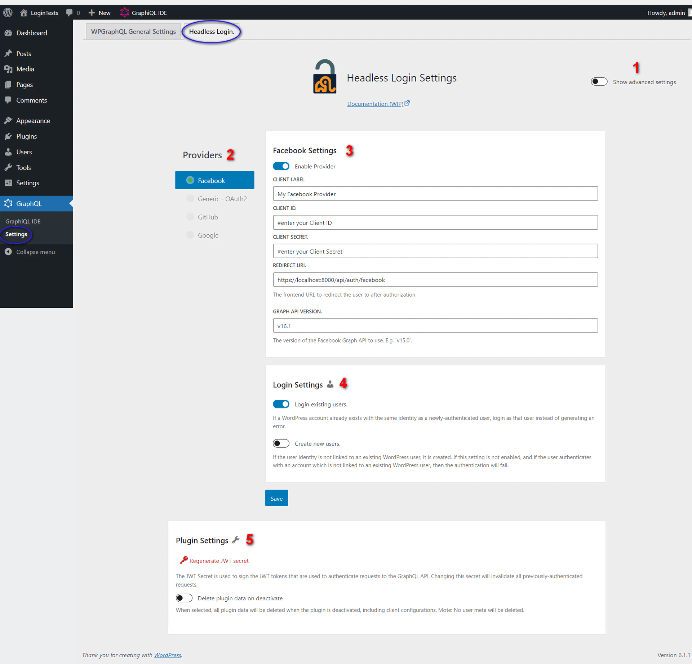

# Settings Guide

<a href="https://raw.githubusercontent.com/axewp/wp-graphql-headless-login/main/assets/screenshot-1.png" target="_blank"> 
Full-size screenshot</a>
</a>

1. **Show advanced settings**: This will show the plugin's and provider-specific advanced settings.
2. **Providers**: The list of registered authentication providers. Providers with a green dot are enabled. Click the provider name to edit its settings.
3. **Provider Settings**: The settings for the selected provider. The settings will vary depending on the provider, but usually include the following:
   1. **Client label**: The name of the Client that will be displayed to users.
   2. **Client ID**: The Client ID created by the provider.
   3. **Client secret**: The Client secret created by the provider.
   4. **Redirect URI**: The Redirect URI that the provider will send the authentication response to. This should be the URL of the Callback API route in your headless app.
4. **Login Settings**: The provider-specific settings for provisioning a user. The settings will vary depending on the provider but usually include the following:
   * **Login existing users**: If enabled, the plugin will attempt to login an existing WordPress user with the same email address as the Resource Owhener sent from the provider.
   * **Create new users**: If enabled, the plugin will create a new WordPress user if the Resource Owner does not have an existing linked account (or one with the same email address if `Login existing users` is enabled).
	 * **Set authentication cookie**: If enabled, the plugin will set a WordPress authentication cookie on successful login. This is useful if you want to use your headless app and WP Admin with the same user session.
5. **Plugin Settings**: These settings are specific to the plugin and don't vary by provider:
   * **Regenerate JWT Secret**: This will regenerate the JWT site secret used to authenticate the GraphQL requests. Changing the secret will invalidate _all_ existing JWT tokens.
	 **Note:** You can also set the JWT secret with code using the `WPGRAPHQL_LOGIN_JWT_SECRET_KEY` constant or [the `graphql_login_jwt_secret_key` filter](filters.md#graphql_login_jwt_secret_key)
	 * **Enable password mutation**: If enabled, the plugin will add a `loginWithPassword` mutation to the GraphQL schema, which allows users to login with their WordPress site username and password.
	 * **Set authentication cookie on password login**: If enabled, the plugin will set a WordPress authentication cookie on successful login with the `loginWithPassword` mutation. This is useful if you want to use your headless app and WP Admin with the same user session.
	 * **Delete plugin data on deactivate**: If enabled, the plugin will delete all of its data when deactivated. This includes all of the plugin's settings including the client configurations. **Note:** The user meta will not be deleted.
